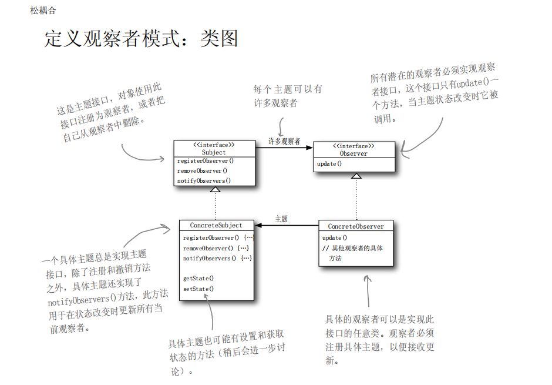

## 策略模式

从实现接口到组合

```
class Duck implements Action {
  ...

  @Override
  public void action(){
    System.out.print("i can dance");
  }
}

// 策略模式

class Duck extend AbstractDuck {

  private AbstractAction duckAction;

  @Override
  public void action(){
    duckAction.action();
  }

  public void setAction(AbstractAction duckAction){
    this.duckAction = duckAction;
  }
}

```

## 订阅模式

分为**推**和**拉**两种

观察者模式定义了对象之间的一对多依赖，这
样一来，当一个对象改变状态时，它的所有依赖者都
会收到通知并自动更新。

**不要依赖于发布者通知的顺序**



## 装饰者模式
